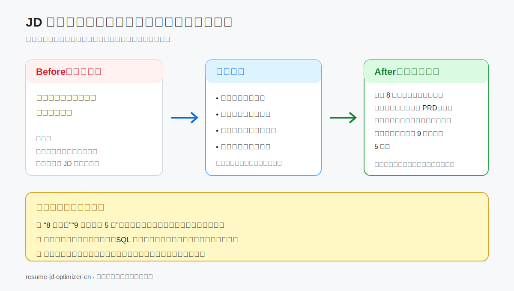

# resume-jd-optimizer-cn

## JD 驱动的中文简历优化 Skill

> 基于目标 JD 和真实经历，诊断岗位差距、追问遗漏素材，并生成 ATS 可读、HR 易判断、面试可自洽的定制简历。

[](LICENSE)
[](SKILL.md)
[](README.en.md)
[](tests/test_cases.md)
[](tests/failure_modes.md)

[English](README.en.md) · [30 秒开始](#30-秒-quick-start) · [安装指南](docs/installation.md) · [完整示例](docs/examples.md) · [FAQ](FAQ.md)

**本项目帮助提高简历表达质量和岗位匹配度，但不保证通过 ATS、获得面试或录用。**

`resume` · `cv` · `job-search` · `jd-analysis` · `ats` · `chatgpt` · `prompt-engineering` · `ai-skill` · `china`

## 适用人群

| 你是谁 | 这个 Skill 能帮什么 |
|---|---|
| 应届生 / 实习生 | 从课程、实习、竞赛和项目中挖掘岗位相关证据 |
| 社招求职者 | 把职责描述重构为可验证的业务贡献 |
| 转行求职者 | 区分直接经验、可迁移能力和真实缺口 |
| 多方向投递者 | 基于同一事实底稿，为不同 JD 分别生成版本 |
| 简历投递反馈较少的人 | 检查 JD 匹配、ATS 可读性和 HR 10 秒阅读体验 |
| AI Agent / Prompt 开发者 | 复用完整 Skill、Prompt、评分规则和测试体系 |

## 这个项目解决什么痛点

| 常见问题 | 项目处理方式 |
|---|---|
| 简历写成岗位职责，没有成果证明 | 追问背景、个人动作、方法、结果和证据来源 |
| 不知道 JD 真正在筛什么 | 拆分硬性门槛、核心职责、技能、加分项和淘汰风险 |
| 经历有价值，但简历没有写出来 | 建立 JD 与真实经历的逐项证据映射 |
| 为了 ATS 机械堆关键词 | 关键词必须绑定真实项目或行动证据 |
| 没有精确数据，不知道怎么写 | 使用可验证交付、采用、流程改善或确认过的区间 |
| “包装”后面试讲不圆 | 对强动词、数字、归因和个人贡献生成尖锐追问 |
| 一份简历投所有岗位 | 为每个具体 JD 独立排序、评分和生成版本 |

## 为什么不是普通简历润色 Prompt

| 普通简历 Prompt | resume-jd-optimizer-cn |
|---|---|
| 直接润色现有句子 | 先解析 JD，再决定优化重点 |
| 可能自动补充数据和职责 | 只允许已确认事实进入最终简历 |
| 关键词越多越好 | 无项目证据的关键词不会被视为充分覆盖 |
| 把“参与”改成“负责/主导” | 使用贡献动词证据门槛 |
| 输出一份万能简历 | 每个 JD 独立生成版本和风险提示 |
| 关注文字是否漂亮 | 同时检查 ATS、HR、面试自洽和可信度 |
| 转行时强行贴近岗位 | 区分直接经验、可迁移经验和学习/作品证据 |

## 核心能力总览

```text
收集输入
  ↓
解析目标 JD
  ↓
解析简历事实底稿
  ↓
映射已覆盖 / 弱覆盖 / 未覆盖 / 不建议硬凑
  ↓
追问真实经历与证据
  ↓
生成 JD 定制版 + ATS 纯文本版
  ↓
执行 HR、面试官与真实性审查
```

| 能力 | 输出 |
|---|---|
| JD 解析 | 岗位目标、硬性条件、技能、业务场景、关键词和权重 |
| 简历诊断 | 表达问题、可信证据、数据深度、成果等级和贡献边界 |
| 缺口分析 | 已覆盖、弱覆盖、未覆盖、可补充和不建议硬凑 |
| 素材追问 | 与高权重 JD 要求对应的具体问题 |
| 简历重写 | JD 定制版、ATS 纯文本版和 HR 摘要 |
| 求职沟通 | Boss 直聘开场白和猎头介绍 |
| 面试准备 | 针对数字、归因、方法和个人贡献的追问 |
| 风险检查 | 编造、夸大、关键词堆砌、AI 味和隐私风险 |

## 30 秒 Quick Start

```text
请使用 resume-jd-optimizer-cn 优化我的简历。

目标 JD：
[粘贴完整 JD]

现有简历：
[粘贴简历]

补充背景：
- 是否转行：
- 可确认数据：
- 作品链接：
- 历史投递反馈：

请先分析 JD 与简历差距。
信息不足时先追问，不要编造。
```

没有完整材料也可以开始：

| 当前材料 | Skill 行为 |
|---|---|
| 只有简历 | 做基础诊断、ATS 结构检查并索取目标 JD |
| 只有 JD | 解析岗位要求并生成素材采集问题 |
| 简历 + 单个 JD | 执行完整诊断、重写和审查 |
| 简历 + 多个 JD | 建立唯一事实底稿，为每个 JD 独立生成版本 |
| 信息严重不足 | 明确阻断，并提出最多 6 个具体输入问题 |
| 用户要求造假 | 停止重写与评分，提供真实替代方案 |

## Demo：输入输出示例



### 输入

```text
目标 JD：
负责企业客户订单管理产品的需求分析与迭代；
要求复杂流程产品经验、PRD、原型和跨团队推进能力。

原始简历：
负责订单系统需求收集和产品迭代。

已确认补充事实：
- 独立访谈 8 家企业客户
- 负责 PRD、原型和验收
- 协同 5 名研发及 1 名设计
- 配置步骤从 9 步减少到 5 步
```

### Skill 先做证据映射

| JD 要求 | 简历证据 | 状态 |
|---|---|---|
| 复杂流程产品经验 | 订单审批流程改版 | 已覆盖 |
| PRD 与原型 | 用户确认负责 PRD、原型 | 已覆盖 |
| 跨团队推进 | 协同 5 名研发及 1 名设计 | 已覆盖 |
| 数据分析 | 暂无分析过程证据 | 弱覆盖 |

### 确认事实后的优化结果

```text
围绕企业客户订单审批场景，访谈 8 家客户并负责 PRD、原型与验收；
协同 5 名研发及 1 名设计推动流程改版上线，将配置步骤从 9 步减少至 5 步。
```

### 面试追问

```text
- 8 家客户如何选择，需求如何归纳和取舍？
- 你与研发、设计分别如何分工？
- 配置步骤减少后，如何验证用户体验确实改善？
```

更多案例见 [完整示例](docs/examples.md) 与 [examples/](examples/)。

## 安装方式

| 环境 | 推荐安装方式 |
|---|---|
| Codex | 将完整仓库复制或克隆到 Codex Skills 目录 |
| ChatGPT Project | 上传核心文件，并在项目指令中加入 `SKILL.md` 规则 |
| 自定义 GPT | 将核心工作流放入 Instructions，上传参考文件作为 Knowledge |
| 自定义 Agent | 始终加载 `SKILL.md`，按阶段加载 Prompt、Rubric 和模板 |

Codex 常见安装示例：

```bash
mkdir -p ~/.codex/skills
git clone https://github.com/coinluu/resume-jd-optimizer-cn.git \
  ~/.codex/skills/resume-jd-optimizer-cn
```

安装后新建会话并调用：

```text
使用 $resume-jd-optimizer-cn 根据我的目标 JD 和真实经历优化中文简历。
```

详细的新手步骤见 [安装指南](docs/installation.md)。不同产品能力可能因账号、版本或工作区权限而不同。

## 使用方式

### 标准单 JD 优化

```text
请先输出 JD 解析、证据映射和关键缺口。
只有信息充分时才生成最终简历和 ATS 版。
```

### 多 JD 独立版本

```text
请基于同一份真实经历底稿，分别为以下 JD 生成版本：
1. 产品经理 JD：[粘贴]
2. 运营 JD：[粘贴]
3. AI 产品经理 JD：[粘贴]

请输出版本差异表，不要生成万能混合版。
```

### 回答素材追问

```text
项目名称：
业务背景：
我的负责范围：
我的具体动作：
协作对象：
结果与数据来源：
哪些属于团队成果：
```

完整调用方式见 [快速开始](docs/quickstart.md)。

## 文件结构

```text
resume-jd-optimizer-cn/
├── SKILL.md             # 核心规则、输入路由与 8 步流程
├── prompts/             # 10 个阶段 Prompt
├── templates/           # 简历、ATS、沟通与报告模板
├── rubrics/             # 5 套评分规则
├── docs/                # 安装、招聘语境、岗位和真实性规则
├── examples/            # 产品、数据、转行 AI 产品案例
├── tests/               # 10 个测试场景与 21 个失败模式
└── .github/             # Issue、PR 模板和 Markdown CI
```

## 支持的岗位类型

| 类别 | 已内置岗位 |
|---|---|
| 产品 | 产品经理、AI 产品经理 |
| 数据与技术 | 数据分析师、Java、Python、前端、算法、测试工程师 |
| 运营与增长 | 运营、新媒体运营、用户增长 |
| 商业与市场 | 销售、商务拓展、市场营销 |
| 交付与设计 | 设计师、项目经理 |
| 求职身份 | 应届生校招、实习生、转行求职者、管培生 |

每类岗位包含核心能力、常见 JD 关键词、成果指标、项目类型、表达重点、面试方向和常见踩坑。详见 [岗位类型参考](docs/role_taxonomy.md)。

## 评分系统

评分用于诊断当前材料，不代表录用概率。

| 评分 | 重点检查 | 满分 |
|---|---|---:|
| JD 匹配分 | 硬性条件、技能证据、项目相关度、成果和职级 | 100 |
| ATS 分 | 标准标题、关键词、结构、技能区和时间线 | 100 |
| HR 吸引力分 | 10 秒方向判断、前部亮点、相关性和简洁度 | 100 |
| 面试准备分 | 背景、个人贡献、方法、数据来源和复盘 | 100 |
| 可信度分 | 数据来源、贡献边界、夸大风险和逻辑自洽 | 100 |

所有分数必须附证据、扣分原因和补分动作。缺少 JD、简历或事实时，相关项目标记为“不适用”或“暂无法评分”，不会猜分。

## 真实性与反夸大原则

| 允许 | 禁止 |
|---|---|
| 提升信息顺序、表达精度和证据密度 | 编造公司、项目、证书、工具或数据 |
| 使用用户确认的估算、区间和规模 | 把参与改成主导 |
| 明确团队成果中的个人贡献 | 把团队结果全部归给个人 |
| 使用可验证的定性交付或改善结果 | 把按期上线写成业务增长 |
| 将转行经历标记为可迁移能力 | 把普通搜索改写成 RAG / Agent 项目 |

贡献动词必须有事实门槛：

```text
支持 / 协助 < 参与 < 负责 < 推动 < 主导
```

若用户要求编造或篡改事实，Skill 会停止评分、重写、ATS 版和最终报告，并提供真实替代方案。

使用前请阅读 [隐私与真实性声明](docs/privacy-and-truthfulness.md)。

## Demo 与截图说明

当前仓库已提供可直接预览的 Before / After SVG Demo，并优先保留可复制的 Markdown 示例。维护者可按照 [截图脚本](assets/screenshot-script.md) 补充脱敏后的真实运行截图，并放置在：

```text
docs/assets/
├── demo-jd-gap-analysis.png
├── demo-before-after.png
├── demo-ats-plain-text.png
└── demo-interview-questions.png
```

建议首页截图依次展示：

1. JD 与简历证据映射表。
2. 优化前后对比。
3. ATS 纯文本版本。
4. 面试追问与真实性风险。

截图不得包含真实联系方式、客户信息或未公开经营数据。

## Roadmap

| 方向 | 计划 |
|---|---|
| 案例覆盖 | 增加更多匿名化真实回归案例 |
| 行业覆盖 | 增加金融、制造、医疗、游戏等岗位参考 |
| 工程能力 | 增加结构化事实底稿和多 JD 差异检查工具 |
| 文件处理 | 探索 PDF / DOCX 文本解析与 ATS 结构检查 |
| 社区评测 | 建立版本化匿名评测集和贡献规范 |

详见 [ROADMAP.md](ROADMAP.md)。

## 贡献指南

欢迎贡献：

- 充分脱敏的真实求职案例。
- 新岗位类型与国内招聘语境。
- Prompt、模板、评分和失败模式改进。
- 安装说明、文档和测试。

提交前请阅读 [CONTRIBUTING.md](CONTRIBUTING.md) 和 [CODE_OF_CONDUCT.md](CODE_OF_CONDUCT.md)。公开 Issue 中不要上传完整真实简历。

## 联系与反馈

如需交流使用问题、反馈案例或讨论贡献，可以通过微信联系维护者：


添加时建议备注 `resume-jd-optimizer-cn`。请勿通过微信发送未脱敏简历、身份证、客户信息、商业机密或其他敏感材料；问题反馈优先使用已脱敏的最小示例。

## Star

如果你认可“先找真实证据，再优化表达”的方式，可以 Star 或 Fork 这个仓库：

- Star：方便求职时重新找到，也帮助更多中文求职者发现项目。
- Fork：根据自己的岗位、行业或 Agent 工作流进行定制。
- Issue / PR：提交脱敏案例、失败模式或规则改进。

Star 不是使用项目的前提。先试用、检查隐私边界，再决定是否保留它。

## License

本项目采用 [MIT License](LICENSE)。你可以在保留许可证声明的前提下使用、修改和分发。

本项目帮助提高表达质量和岗位匹配度，不保证通过 ATS、获得面试或录用结果。
